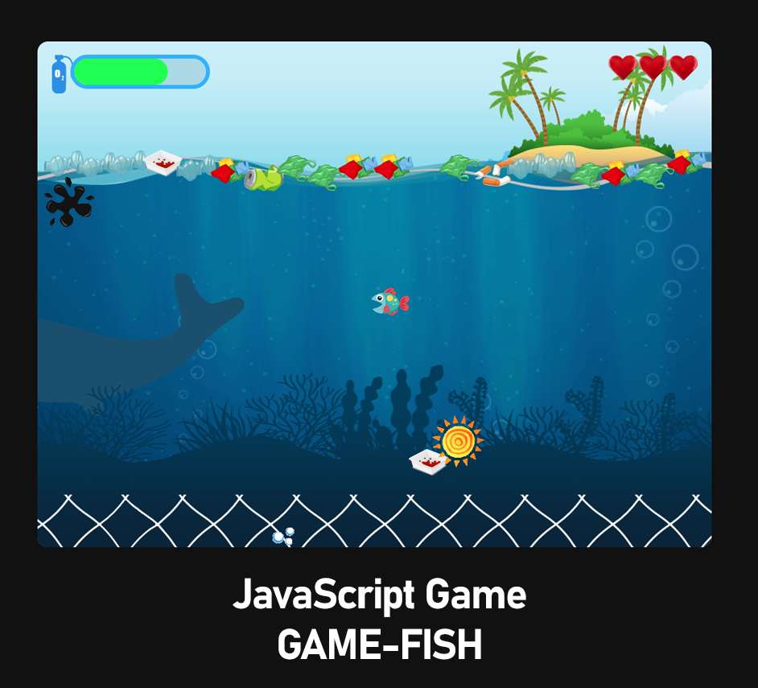

<h1 align="center">Project Game Fish</h1>

<!--  -->

<h2 align="center"><a  href="http://yurylisovsky.colocall.com/portfolio/game-fish/">Play</a></h2>

## Description

This project is an interactive game. It was developed during a course at EduCoin. This course consisted of several parts. At the end of each module a project was developed based on the materials of the module.

I came up with the idea of ​​a game related to ecology. Because environmental issues are more urgent than ever.

The aim of the game is to save the sea from oil stains and debris. Collect yellow suns of energy - it will help recycle garbage. Beware of fishing nets, debris and oil slicks. If you get in the trash, you lose your life. If you get on an oil slick - you lose air supply. You need oxygen to live. Over time, it ends. You need to catch air bubbles to replenish oxygen.

## How to play

### Mouse:

Move the mouse to guide the fish. The fish swims at the mouse cursor.

### Keyboard:

Use the cursor to control the fish. W - up, S - down, D - right, A - left. Use a pair of keys to move diagonally

## About the project.

This project used JavaScript and CSS.

Graphics were prepared using Adobe Illustrator and Adobe Photoshop

